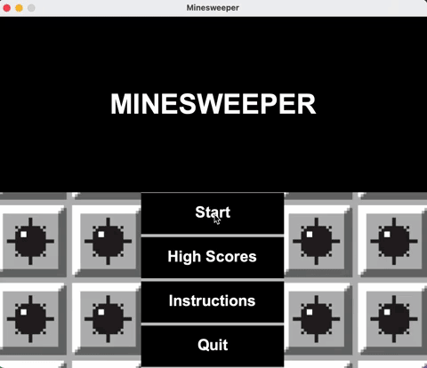

# Minesweeper
A Minesweeper clone made in Java.

## Features
Features of this Minesweeper Clone:
* Different levels
* Sound effects
* Recursive tile expansion
* Right-click to flag
* Storing high scores (fastest times)

## To Play
Clone the repo and run the [Driver](https://github.com/JY2452/minesweeper/blob/master/src/Driver.java) located in the `src directory`.

To save time, a demo gif is included at the top of this README file, demonstrating gameplay.

## References
* [Minesweeper Game](http://minesweeperonline.com/) available online as an example.
* [How to Play Minesweeper](http://www.wikihow.com/Play-Minesweeper) Tutorial on WikiHow.
* [Minesweeper Guide](https://www.cs.ubc.ca/~acton/techTrek/MineSweeper/Minesweeper.pdf) by the CS Department at the University of British Columbia.